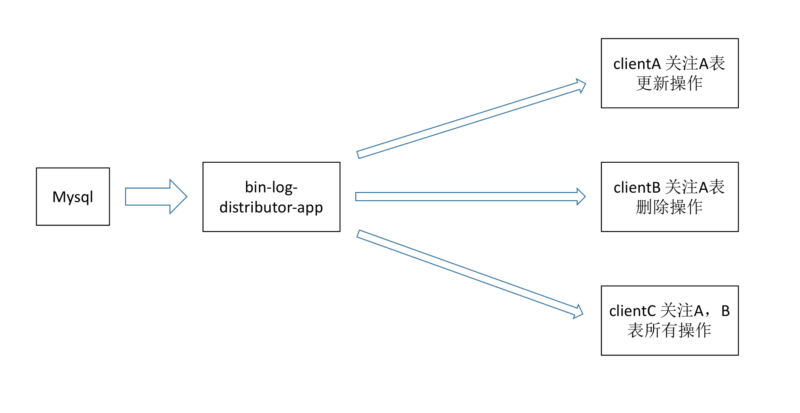

# 1 概述
>mysql数据变动监听分发
>本项目意在简化监听mysql数据库的不同表的各种数据变动
>项目依赖redis,mysql
>使用场景：刷新缓存、异构系统...


# 2 使用方式
>从bin-log-distributor-app到client数据分发方式的默认实现为redis，如果要开发基于其他的比如mq，只需要分别实现`bin-log-distributor-pub`下的`DataPublisher`接口与`bin-log-distributor-client`下的`DatabaseEventHandler`接口即可
## 2.1 服务端
服务端是项目中`bin-log-distributor-app`模块，在[mysql-binlog-connector-java](服务端是项目中`bin-log-distributor-app`模块，在[mysql-binlog-connector-java]()提供了监听mysql数据库二进制日志的功能
)基础上提供了监听mysql数据库二进制日志并进行分发的功能

### 2.1.1 参考配置
```
# redis地址
spring.redisson.address=redis://192.168.1.204:6379

# mysql日志同步账户,
binaryLog.host = 192.168.1.204
binaryLog.port = 3306
binaryLog.username = aa
binaryLog.password = aa
binaryLog.serverId = 1

# 读取列名，进行映射，可以和
spring.datasource.url = jdbc:mysql://${binaryLog.host}:${binaryLog.port}/mysql?autoReconnect=true&amp;useUnicode=true&amp;characterEncoding=utf-8
spring.datasource.username = ${binaryLog.username}
spring.datasource.password = ${binaryLog.password}
spring.datasource.driverClassName = com.mysql.jdbc.Driver
```

### 2.1.2 启动方式
编译打包项目，直接通过（java -jar）启动bin-log-distributor-app-${version}-SNAPSHOT.jar，可参考[spring boot手册](https://docs.spring.io/spring-boot/docs/current-SNAPSHOT/reference/htmlsingle/#using-boot-running-your-application)

## 2.2 客户端
### 2.2.1 引入依赖包
```
<!-- 监听数据库 -->
<dependency>
    <groupId>cn.keking.project</groupId>
    <artifactId>bin-log-distributor-client-redis</artifactId>
    <version>${version}</version>
</dependency>
```

### 2.2.2 添加客户端配置
```
#自动注册客户端(2.1中服务端的地址)
databaseEventServerUrl=http://localhost:8885/client/addAll
#本应用命名
appName=lbt-service-ext
```

### 2.2.3 写handler，实现 DatabaseEventHandler 接口，并加上注解 @HandleDatabaseEven 
```
/**
 * LockLevel为保持顺序的级别,None为默认
 * TABLE -> 同表按顺序执行
 * COLUMN -> 某列值一致的按顺序执行
 * NONE -> 无序
 */
@Service
@HandleDatabaseEvent(database = "test", table = "products", events = {DatabaseEvent.UPDATE_ROWS, DatabaseEvent.DELETE_ROWS},lockLevel = LockLevel.TABLE)
public class ProjRepHisDatabaseEventHandler implements DatabaseEventHandler {
    private static final Logger logger = LoggerFactory.getLogger(ProjRepHisDatabaseEventHandler.class);

    @Override
    public void handle(EventBaseDTO eventBaseDTO) {
        logger.info(JSON.toJSONString(eventBaseDTO));
        // todo 在这里写相关逻辑
    }
}
```

### 2.2.4 启动监听，当2里的handler是由容器管理时需要通过registerHandler(projRepHisDatabaseEventHandler)手动注册，如果不需要容器管理，可以直接通过autoScanHandler()自动扫描添加
```
@Component
public class DatabaseEventListener {
    private static Logger logger = LoggerFactory.getLogger(DatabaseEventListener.class);
    @Autowired
    private RedissonClient redissonClient;

    @Value("#{env.databaseEventServerUrl}")
    private String serverUrl;
    @Value("#{env.appName}")
    private String appName;
    //将第3步里的service注入
    @Autowired
    private ProjRepHisDatabaseEventHandler projRepHisDatabaseEventHandler; 

    @PostConstruct
    public void start() {
        //初始化订阅的实现
        DataSubscriber dataSubscriber = new DataSubscriberRedisImpl(redissonClient);
        new BinLogDistributorClient(appName, dataSubscriber)
                //在binlog中注册handler
                .registerHandler(projRepHisDatabaseEventHandler)
                .setServerUrl(serverUrl).autoRegisterClient().start();
    }
}
```

# 2.3 前端管理模块
>前端管理服务模块是基于vue的管理各个应用监听状况的管理界面
 
# 3 其他


